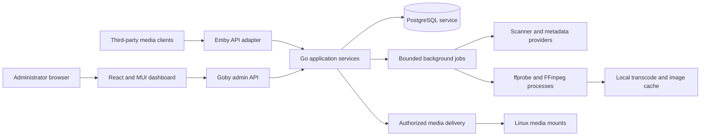

# Linux architecture: Go backend and React administrator dashboard

Status: **implementation design; M1 service foundation in progress**. Requirements were updated on 2026-09-09 to use PostgreSQL. This document defines the target architecture; a described feature is not a claim of completed implementation or runtime compatibility. The external contract baseline is described in [source provenance](../sources/README.md).

## Architecture decision

Start with one Go application service, a separate PostgreSQL database service, bounded background workers, and external FFmpeg/ffprobe processes. Serve the built React administrator dashboard from the Go binary. PostgreSQL may run on the same Linux host or on a separately configured database host; it is a required service rather than an embedded component of the Go executable. Media mounts and disposable transcode/image caches remain owned by the application host.

Keep Emby DTOs at the HTTP boundary. Model Goby's media, users, sessions, and jobs independently so upstream API changes do not dictate database structure. Both API surfaces call the same authorization rules and application services.



### Public surfaces

| Surface | Purpose | Authentication |
| --- | --- | --- |
| `/emby/...` | Emby-compatible REST operations | Emby user tokens / authorized API keys; explicit bootstrap exceptions |
| WebSocket route | Emby event and session protocol | Emby token and session/device checks; path and handshake need target-version fixtures |
| UDP discovery, optional | Documented local server discovery | Minimal public identity response; LAN configuration only |
| `/admin/` | React/MUI static administrator application | Shell may be public; all administrative data remains protected |
| `/admin/v1/...` | Goby-owned operational APIs | Administrator session cookie, CSRF defense, server-side authorization; explicit setup/login exceptions |
| Internal health/metrics | Supervision and operations | Minimal public liveness only if enabled; readiness/details/metrics restricted |

The documented compatibility base is `/emby`. Root-path aliases and legacy route variants are adapters added when their client behavior is evidenced. A client-visible server address must come from configured public URL or trusted proxy metadata, not an arbitrary `Host` header. Do not advertise Emby cloud connectivity, paid features, or codecs that Goby cannot supply.

The native admin API uses a deny-by-default route policy. Only minimal setup status, setup submission protected by the one-time deployment secret, and rate-limited credential login are reachable without an existing administrator session. Setup submission closes atomically after initialization. Apply origin/CSRF protections appropriate to these bootstrap flows as well as authenticated mutations.

## Go implementation boundaries

Proposed layout:

```text
cmd/goby/
internal/transport/emby/
internal/transport/admin/
internal/transport/websocket/
internal/auth/
internal/users/
internal/library/
internal/metadata/
internal/playback/
internal/jobs/
internal/events/
internal/storage/postgres/
internal/platform/linux/
web/admin/
deploy/linux/
docs/
```

Use `net/http` with explicit routes and middleware; the standard router supports method and wildcard patterns. Keep routing separate from Emby query decoding because placeholders embedded in filenames, comma-separated lists, repeated parameters, casing, and default values require contract-specific handling. Do not select a large framework just to avoid writing the compatibility adapter. [Go routing reference](https://go.dev/doc/go1.22).

Use `github.com/jackc/pgx/v5` and `pgxpool` for PostgreSQL access, with explicit versioned SQL migrations. Configure connection limits, idle lifetime, connection timeout, and operation deadlines; return connections after each bounded operation. Close the pool during graceful shutdown. Use a database role with only the privileges required by Goby's schema and keep credentials out of logs and client-visible configuration. Set TLS requirements explicitly for remote database connections. [pgx documentation](https://pkg.go.dev/github.com/jackc/pgx/v5), [pgxpool documentation](https://pkg.go.dev/github.com/jackc/pgx/v5/pgxpool).

The current stable toolchain baseline is **Go 1.27.1 and FFmpeg/ffprobe 9.0.1**, verified from official release sources on 2026-09-09. Pin exact Go, Node, React, MUI, PostgreSQL deployment, and FFmpeg build versions in release tooling as they are integrated. The [toolchain policy](../development/toolchain.md) records source evidence and the limits of local build authorization.

Generate boundary types only from a reviewed, normalized subset of the source specification. Review numeric widths, nullable values, unions, unknown responses, and authentication manually. Generated Go handlers do not supply the missing media behavior. Create the `/admin/v1` specification independently and generate its TypeScript types for the dashboard.

## Data model

| Entity | Essential persisted data and constraints |
| --- | --- |
| Server identity | Stable server ID, advertised name, configuration revision, schema version |
| User | Stable ID, normalized login key, display name, password verifier, enabled state |
| User policy | Administrator capability, library access, content restrictions, playback/transcode/download/delete permissions |
| Token | Token hash, user or application principal, device binding, creation/revocation metadata; store plaintext only when initially issuing it |
| Library and root | Type, allowlisted Linux roots, scan settings, metadata settings, revision |
| Item | Stable opaque API ID, parent/library IDs, media type, title/sort fields, dates, provider IDs |
| Media source | File identity, path, container, duration, bitrate, size, probe revision, source ID |
| Stream | Source ID, stream index, codec, language, channels, dimensions, subtitle/disposition data |
| Image | Owner, type/index, origin, content fingerprint/tag, cache representation |
| User item state | Unique user/item key, position ticks, play count, last-played time, favorite/played flags |
| Playlist / collection | Owner/access, ordered entries, stable playlist entry IDs distinct from item IDs |
| Device / session | Stable device identity, token relation, capabilities; active sessions and heartbeat times |
| Job | Type, arguments, status, lease/cancellation, bounded progress, result/error, retry policy |
| Audit | Principal, action, resource, timestamp, outcome; no passwords, tokens, or raw authorization headers |

Keep API IDs opaque strings. Do not derive identity solely from a path or expose database sequence numbers as an assumed Emby ID format. Define rename/move reconciliation and collision behavior. Use `int64` for ticks and sizes in Go. At the JSON boundary, preserve the upstream number/string contract; do not silently stringify numbers to accommodate JavaScript. Audit precision in dashboard code and avoid parsing opaque IDs as numbers.

Use short PostgreSQL transactions for related writes and commit scan batches without holding a transaction open during filesystem access, provider calls, or FFmpeg execution. PostgreSQL supports concurrent writers; coordinate conflicting rows with appropriate row locks or conditional updates, rather than imposing a global application write queue. Enforce unique user/item state and identity constraints in the database. Add indexes around library/parent/type queries and `(user_id,item_id)` state. Establish case folding and Unicode search correctness before adding PostgreSQL full-text or trigram indexes. [PostgreSQL concurrency control](https://www.postgresql.org/docs/current/mvcc.html).

Apply numbered migrations under a PostgreSQL advisory lock so concurrent startup attempts cannot race. Record the applied version and checksum, use a transaction for each migration that supports it, and fail startup on a mismatched or failed migration. First-administrator creation, token revocation, and final-administrator protection require transactional invariants. Durable jobs can use leases and `FOR UPDATE SKIP LOCKED` for bounded worker claims; a job must not hold an open database transaction while it runs.

Media may reside on mounted NFS/SMB storage. Keep the active transcode cache on the application host's local disk and PostgreSQL data in storage managed by the database service; the application never opens PostgreSQL data files directly. Multiple serving nodes remain a later deployment design. A shared database alone does not distribute sessions, filesystem identity, job ownership, or transcode output.

## Library ingestion and metadata

1. An administrator selects an allowlisted Linux root. Resolve canonical paths, enforce containment, and check service-account access.
2. A job inventories files with bounded concurrency, treats file modifications atomically where possible, and tolerates files still being copied.
3. `ffprobe` extracts technical metadata under time, memory, output-size, and process-concurrency limits.
4. Filename and local sidecar metadata establish usable items without mandatory cloud access.
5. Optional provider adapters enrich metadata and images with timeouts, caching, rate limits, and explicit administrator configuration.
6. Commit batches and publish library-change events after durable state changes. A transient missing network mount must not mass-delete the catalog.

Use inotify as a hint plus periodic reconciliation. Coalesce events, detect queue overflow, and handle rename pairs and inaccessible roots. For NFS/SMB mounts, make polling/reconciliation authoritative. Follow a documented symlink policy and re-check containment when opening files to address path races. File deletion is a separate privileged feature, disabled by default; library removal must not implicitly erase media.

## Playback and process lifecycle

The planner intersects source characteristics, user policy, client `DeviceProfile`, requested streams, bitrate, and server encoder availability. It returns only feasible `MediaSources` and URLs. Prefer direct play, then remux/audio conversion, then full transcoding when the requested combination requires it. See the [playback research](../research/playback-and-transcoding.md).

Serve direct files with correct `GET`/`HEAD`, byte ranges, conditional requests, content length/type, and cancellation. Apply the same library/user authorization to downloads, images, subtitles, playlists, and segments. A playable URL must not become a permanent public bypass.

Each transcode has an owner, a stable session ID, input/source binding, normalized options, work directory, process group, resource budget, and expiry. Use argument arrays with `os/exec`, never a shell-built FFmpeg command. Limit protocol access for externally supplied URLs. Do not kill a multi-request HLS job merely because one segment request disconnects; manage it through playback session references and idle expiry.

Support cancellation, watchdog timeouts, per-user/global concurrency, CPU/memory limits, disk watermarks, atomic segment publication, and crash recovery. Restart recovery removes or reaps expired jobs safely within the configured cache root. Preserve referenced segments until the client window no longer needs them. Never assume a GPU node means a requested encoder, decoder, or tone-mapping path is usable.

Software H.264/AAC provides an initial portable transcoding profile subject to the selected FFmpeg build. Support Linux hardware acceleration through explicit VAAPI, Intel QSV, and NVIDIA profiles. Treat hardware decoding and hardware encoding as separate capabilities: source decoding, pixel-format conversion, hardware frame transfer, scaling/tone mapping, subtitle filtering, and output encoding must form a supported pipeline. A detected encoder is not evidence that hardware decoding works. Record per-codec/profile/bit-depth capabilities, driver/device prerequisites, and the configured software fallback policy. Run actual decode and encode verification independently and together on the remote Linux test/release environment; a CPU-only machine cannot establish GPU support. See the [toolchain and hardware verification policy](../development/toolchain.md).

## Administrator dashboard

Use React, TypeScript, and Material UI with a consistent Material Design theme. Use a permanent/responsive navigation drawer, app bar, tables, forms, dialogs, alerts, and progress views. The dashboard contains no playback route and no consumer browse-and-watch workflow. Active sessions can expose administrative stop/diagnostic actions without embedding a video player.

Use a shared API client, query caching for server state, and schema-driven forms where useful. Select optional libraries at implementation time; React and MUI are the required choices. Prefer MUI core and community components unless a paid component has been explicitly selected. Ensure keyboard navigation, accessible field errors, visible focus, responsive tables, and semantic status messages. The [dashboard research](../research/admin-dashboard-and-linux.md) supplies the page/API mapping.

For browser authentication, issue an opaque server-side session cookie with `HttpOnly`, `Secure` under HTTPS, and an appropriate `SameSite` policy. Protect mutations with CSRF validation and origin checks. Recheck administrator authorization server-side for every operation. Keep client-compatible user tokens separate from browser session handling; both map to the same authorization service. Do not persist full-access API keys in browser local storage.

## Goby-owned API proposal

These routes are design proposals, **not Emby APIs**. Standard administration such as library and user operations can be exposed through this facade while sharing the existing services and audit rules.

| Proposed route | Purpose |
| --- | --- |
| `GET /admin/v1/bootstrap` | Return minimal setup state without secrets |
| `POST /admin/v1/bootstrap` | Create the first administrator using a one-time local setup secret; atomically disable after success |
| `POST /admin/v1/session` | Administrator login and cookie creation |
| `GET /admin/v1/session` | Current administrator and UI permissions |
| `DELETE /admin/v1/session` | Revoke browser session |
| `GET /admin/v1/capabilities` | Implemented features, release identity, and compatibility profile |
| `GET /admin/v1/diagnostics` | Redacted system, storage, and encoder diagnostics |
| `GET /admin/v1/jobs` | Goby background work, including detailed scan/transcode failures |
| `POST /admin/v1/jobs/{id}/cancel` | Cooperative cancellation with an auditable result |
| `POST /admin/v1/backups` | Create a consistent Goby backup job |
| `GET /admin/v1/backups/{id}` | Backup status and metadata |
| `POST /admin/v1/restores/plan` | Inspect a supplied backup and produce a reviewable restore plan |
| `POST /admin/v1/restores/{id}/apply` | Administrator applies the selected restore under exclusive maintenance mode |

Use a separately versioned OpenAPI 3 contract for these routes with explicit error codes and request IDs. Avoid copying unresolved Emby error semantics into the native API. Backup endpoints target Goby's schema; compatibility with Emby backup archives is not assumed.

## Linux packaging and operations

Deliver Linux amd64 and arm64 artifacts. Build React assets and embed them in the Go artifact. Local builds may check compilation under the current authorization; execution and acceptance checks run on `test-env`. Package a documented PostgreSQL service connection and either a version-pinned system FFmpeg dependency or a reproducible container image containing an audited FFmpeg build. Do not claim a single static binary includes the database server or media codecs.

| Concern | Proposed default |
| --- | --- |
| Service identity | Dedicated unprivileged `goby` user/group |
| Config | `/etc/goby` or an explicit container config mount |
| Application state | `/var/lib/goby` for application-owned persistent files; PostgreSQL catalog state belongs to the configured database service |
| Database | Required PostgreSQL service, bounded `pgxpool`, explicit credentials/TLS, versioned migrations, independent persistent data volume |
| Cache | `/var/cache/goby`, bounded and separately disposable |
| Logs | Structured stdout/stderr, collected by journald or container runtime |
| Media | Explicit mounts such as `/media/movies`, read-only by default |
| HTTP | Configurable unprivileged port; default candidate 8096, TLS via a trusted reverse proxy |
| Discovery | Optional UDP 7359 when LAN auto-discovery is desired |
| Transports | REST, large/range responses, HLS, and WebSocket forwarded consistently |

Provide systemd and OCI/container deployment guides. Harden filesystem access, capabilities, and process resources; accommodate only configured writable roots and permitted GPU devices. Container networking must explicitly account for discovery broadcasts. Do not enable arbitrary host networking as a universal requirement.

Back up the PostgreSQL database using `pg_dump --format=custom` with a client version compatible with the server. Include schema/tool versions, configuration, necessary metadata, and the backup manifest; identify excluded caches and media, and protect secret-bearing archives. `pg_dump` provides a consistent database snapshot, but application-owned files still need a documented coordination strategy. For restore, enter maintenance mode, preserve the current database, restore into a separate database with `pg_restore`, inspect migration/identity compatibility, and activate the restored database only after checks pass. Define ownership and privilege handling explicitly, for example with `--no-owner --no-acl` when restoring as Goby's deployment role. Rehearse backup and restore on Linux before claiming support. [PostgreSQL SQL dump and restore](https://www.postgresql.org/docs/current/backup-dump.html), [pg_restore documentation](https://www.postgresql.org/docs/current/app-pgrestore.html).

Expose scan lag/errors, HTTP latency, active sessions, transcode queue depth, FFmpeg failures, cache usage, and database contention. Redact token-bearing query strings from proxy and application logs. Upgrade through versioned migrations with pre-upgrade backup and explicit rollback compatibility. Protect restart/shutdown APIs behind administrator policy and define whether the supervisor will restart the process.
