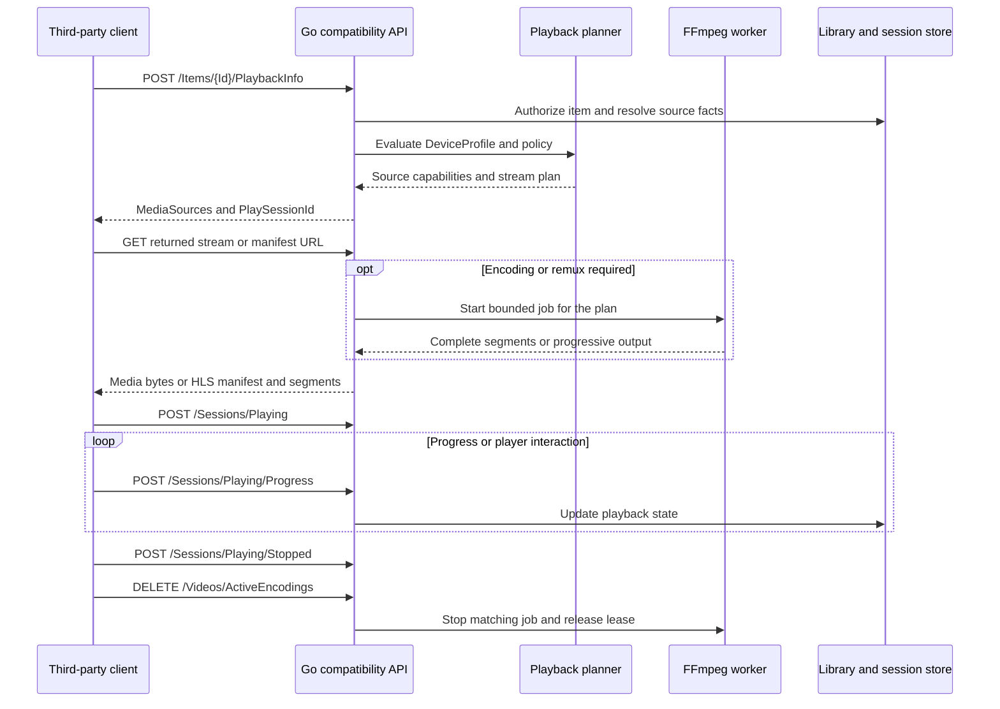

# Playback and Transcoding Research

Research date: 2026-09-09. Scope: a Linux-only Go backend that serves existing Emby-compatible third-party clients. The React/MUI dashboard manages sessions, jobs, and encoding policy; it does not contain a media player.

This is an implementation proposal and a documented protocol baseline, not a claim of tested compatibility. No local tests, builds, runtime probes, or remote playback experiments were performed for this document.

The [implementation scope](../api/implementation-scope.md) controls P0/P1 scheduling across the project. This research explains the playback responsibilities within those stages.

## 1. Evidence and compatibility boundary

Use the [official SDK specification pinned to commit `bdd0dd7c0801f6e069dff2795d80cddae6f91791`](https://github.com/MediaBrowser/Emby.SDK/blob/bdd0dd7c0801f6e069dff2795d80cddae6f91791/Documentation/Download/openapi_v2_noversion.json) as the primary machine-readable baseline. The parent SDK release identifies itself as 4.9.5.0, dated 2026-05-18. The specification itself omits `info.version`; the release association is provenance, not proof that every running 4.9.5.0 server behaves identically. A local copy is [emby-sdk-openapi.snapshot.json](../sources/emby-sdk-openapi.snapshot.json).

The [static Swagger specification](https://swagger.emby.media/openapi.json), stored as [emby-openapi.snapshot.json](../sources/emby-openapi.snapshot.json), identifies version 4.1.1.0 and is retained only for historical comparison. Do not use it as the current complete contract. Its configured server addresses are data in the upstream artifact, not test targets.

Evidence labels in this document:

| Label | Meaning |
| --- | --- |
| `SDK` | A method, route, field, or declared response is present in the pinned 4.9.5.0 SDK specification. |
| `Guide` | Behavior is described in an official Emby workflow guide. Guides can lag or disagree with generated references. |
| `Design` | Recommended behavior for this project; it is not a verified Emby behavior. |
| `Pending` | Requires an authorized reference-server and real-client trace before it can be called compatible. |

All routes below are API-relative. The documented API base is `http[s]://host:port/emby`; deployment behind a reverse proxy must preserve its configured base path. Root-route aliases and other path variants are separate compatibility decisions that need evidence. The official [API entry guide](https://dev.emby.media/doc/restapi/index.html) describes JSON and XML; this document uses JSON examples and does not establish XML compatibility.

### Important discrepancies

| Topic | Evidence | Consequence |
| --- | --- | --- |
| Time units | Current [HLS reference](https://dev.emby.media/reference/RestAPI/DynamicHlsService/getVideosByIdMasterM3u8.html) and SDK say `1 ms = 10000 ticks`. The old static specification reverses this relationship. | Use signed 64-bit integers; `1 second = 10000000 ticks`. Never copy the old description into conversion code. |
| Stream authentication | Current SDK and generated stream references require an authenticated user. The old static HLS definition says authentication is unnecessary. | Protect streams, manifests, subtitles, attachments, and segment access. Do not reproduce the old anonymous-access annotation. |
| Stream request parameters | The [video guide](https://dev.emby.media/doc/restapi/Video-Streaming.html) requires `MediaSourceId` and `PlaySessionId`. Generated streaming operations omit them. | Preserve guide-supported parameters and inspect actual generated URLs. Treat the specification as incomplete here. |
| Universal audio | The [audio guide](https://dev.emby.media/doc/restapi/Audio-Streaming.html) documents format and bitrate negotiation. Unsuffixed `/universal` SDK operations list only `Id`, `DeviceId`, and `StartTimeTicks`; `/universal.{Container}` also requires path `Container`. | Implement the guide's capability parameters, and confirm defaults and redirect behavior remotely. |
| HLS cleanup | The guide shows cleanup with `DeviceId`; current SDK requires both `DeviceId` and `PlaySessionId`. | Start with ownership-scoped cleanup using both IDs. Legacy device-only cleanup needs a separately tested rule. |
| Playback report DTOs | The guide describes stopped reports as identical to started reports. Current `PlaybackStopInfo` has a distinct property set. | Use the current distinct DTO, accept harmless extra input fields, and preserve unknown-field compatibility. |
| Subtitle offset | The guide calls `SubtitleOffset` floating point; current start/progress DTOs declare `int32`, with no unit explanation. | Do not invent a conversion. Capture client values and visible subtitle timing before fixing the wire interpretation. |
| Generated HTML types | Some rendered references display `DeviceProfile[]` where the pinned SDK declares a singular `DeviceProfile` object. | Use the underlying schema and actual client requests, not rendered array notation alone. |
| Segment routes | `HlsSegmentService` in the SDK lists encoding cleanup, but does not specify the VOD segment route templates or manifest grammar. | Record manifests and their requested child URLs from the chosen reference release. Do not infer Emby routes from Jellyfin. |

## 2. Playback API inventory

`GET, HEAD` below denotes two actual declared methods. Braces are path parameters, not literal URL text. A response described as `binary/manifest expected` is an inference from the route and guide: the SDK only declares HTTP 200 with unknown content and does not define its media type or complete headers.

### Negotiation and source lifetime

| Methods | Route | Contract summary | Priority |
| --- | --- | --- | --- |
| `GET` | `/Items/{Id}/PlaybackInfo` | Required path `Id`, required query `UserId`; HTTP 200 `PlaybackInfoResponse`. `SDK` | P0 |
| `POST` | `/Items/{Id}/PlaybackInfo` | Required path `Id`, required JSON `PlaybackInfoRequest`; HTTP 200 `PlaybackInfoResponse`. `SDK` | P0 |
| `POST` | `/LiveStreams/Open` | Required JSON `LiveStreamRequest`; HTTP 200 `LiveStreamResponse` containing `MediaSource`. `SDK` | P1 when sources need opening |
| `POST` | `/LiveStreams/Close` | Required query `LiveStreamId`; HTTP 200 empty. `SDK` | P1 when sources need closing |
| `POST` | `/LiveStreams/MediaInfo` | Required query `LiveStreamId`; HTTP 200 content unspecified. `SDK` | P1 when sources need opening |

The `LiveStreams` name does not mean these DTOs are exclusively a Live TV subsystem: the official operation summaries describe opening and closing a media source. Local regular-file sources can initially report `RequiresOpening=false` and `RequiresClosing=false`; do not advertise source types that the implementation cannot open.

### Audio and video delivery

| Methods | Route | Contract summary | Priority |
| --- | --- | --- | --- |
| `GET, HEAD` | `/Videos/{Id}/stream` | Original-file or progressive video response; common streaming parameters below. `SDK`, `Guide` | P0 original file; P1 progressive transcode |
| `GET, HEAD` | `/Videos/{Id}/stream.{Container}` | Container suffix is the output format; original suffix for `Static=true`. `SDK`, `Guide` | P0 |
| `GET, HEAD` | `/Videos/{Id}/{StreamFileName}` | SDK alias with required path `StreamFileName`; exact accepted filenames need evidence. | P0 original file |
| `GET, HEAD` | `/Audio/{Id}/universal` | Server chooses compatible delivery from client format/bitrate parameters. `SDK`, `Guide` | P1 |
| `GET, HEAD` | `/Audio/{Id}/universal.{Container}` | SDK suffix variant additionally requires path `Container`; negotiation and redirects still need fixtures. | P1 |
| `GET, HEAD` | `/Audio/{Id}/stream` | Original-file or progressive audio response. `SDK`, `Guide` | P0 original file; P1 conversion |
| `GET, HEAD` | `/Audio/{Id}/stream.{Container}` | Audio suffix alias. `SDK`, `Guide` | P0 original file |
| `GET, HEAD` | `/Audio/{Id}/{StreamFileName}` | SDK alias; accepted filenames need evidence. | P0 original file |
| `GET, HEAD` | `/Videos/{Id}/master.m3u8` | HLS master manifest expected; SDK content unspecified. | P1 |
| `GET` | `/Videos/{Id}/main.m3u8` | HLS media manifest expected; SDK content unspecified. | P1 |
| `GET` | `/Videos/{Id}/live.m3u8` | HLS delivery variant; live-window and seek behavior need capture. | P1 |
| `GET, HEAD` | `/Audio/{Id}/master.m3u8` | Audio HLS master manifest expected. | P1 |
| `GET` | `/Audio/{Id}/main.m3u8` | Audio HLS media manifest expected. | P1 |
| `GET` | `/Audio/{Id}/live.m3u8` | Audio HLS delivery variant. | P1 |
| `DELETE` | `/Videos/ActiveEncodings` | Required query `DeviceId` and `PlaySessionId`; HTTP 200 content unspecified. | P1 |
| `POST` | `/Videos/ActiveEncodings/Delete` | Current SDK alternate cleanup method, with the same required query fields. | P1 |

Live TV tuner, recording, channel, and `/LiveTv/...` streaming operations belong to a later optional subsystem. Supporting regular-file playback does not require advertising Live TV support. Never return a successful playable source for a deferred subsystem.

### Subtitles and attachments

| Methods | Route | Contract summary | Priority |
| --- | --- | --- | --- |
| `GET, HEAD` | `/Videos/{Id}/{MediaSourceId}/Subtitles/{Index}/Stream.{Format}` | Required path identifiers, stream `Index` and `Format`; optional query `StartPositionTicks`, `EndPositionTicks`, `CopyTimestamps`. | P0 text subtitles |
| `GET, HEAD` | `/Items/{Id}/{MediaSourceId}/Subtitles/{Index}/Stream.{Format}` | Current SDK alias with the same fields. | P0 |
| `GET, HEAD` | `/Videos/{Id}/{MediaSourceId}/Subtitles/{Index}/{StartPositionTicks}/Stream.{Format}` | Offset is a required path integer instead of a query value; optional `EndPositionTicks`, `CopyTimestamps`. | P1 |
| `GET, HEAD` | `/Items/{Id}/{MediaSourceId}/Subtitles/{Index}/{StartPositionTicks}/Stream.{Format}` | Current SDK alias for the offset route. | P1 |
| `GET` | `/Videos/{Id}/subtitles.m3u8` | Required path `Id`, required query `SubtitleSegmentLength` and `ManifestSubtitles`; HTTP 200 content unspecified. | P1 |
| `GET` | `/Videos/{Id}/live_subtitles.m3u8` | Same declared parameters; exact subtitle-window semantics need capture. | P1 |
| `GET` | `/Videos/{Id}/{MediaSourceId}/Attachments/{Index}/Stream` | Required path `Id`, `MediaSourceId`, integer `Index`; HTTP 200 content unspecified. | P1 for font-dependent subtitles |

The [subtitle guide](https://dev.emby.media/doc/restapi/Subtitles.html) documents `srt` and `vtt` outputs when `IsTextSubtitleStream=true`. It does not establish that bitmap subtitles can be converted into text, nor that ASS styling survives SRT/WebVTT conversion. The SDK's `SubtitleDeliveryMethod` enum is `Encode`, `Embed`, `External`, `Hls`, `VideoSideData`; advertise only methods supported for the selected source and client.

Subtitle search, downloading from providers, deletion, and library editing are administrative operations and should be documented separately from playback delivery. A native subtitle-upload feature would require its own contract; it is not a declared upload route in the current SubtitleService inventory.

### Reports, active sessions, and remote control

| Methods | Route | Contract summary | Priority |
| --- | --- | --- | --- |
| `POST` | `/Sessions/Playing` | Required JSON `PlaybackStartInfo`; HTTP 200 empty. | P0 |
| `POST` | `/Sessions/Playing/Progress` | Required JSON `PlaybackProgressInfo`; HTTP 200 empty. | P0 |
| `POST` | `/Sessions/Playing/Stopped` | Required JSON `PlaybackStopInfo`; HTTP 200 empty. | P0 |
| `POST` | `/Sessions/Playing/Ping` | Optional query `PlaySessionId`; HTTP 200 empty. Timeout/lease meaning is not specified. | P0 |
| `GET` | `/Sessions` | Optional query `ControllableByUserId`, `DeviceId`, `Id`; HTTP 200 `Session.SessionInfo[]`. | P0 dashboard visibility |
| `POST` | `/Sessions/Capabilities` | Required query session `Id`; optional query `PlayableMediaTypes`, `SupportedCommands`, `SupportsMediaControl`, `SupportsSync`; HTTP 200 empty. | P0 |
| `POST` | `/Sessions/Capabilities/Full` | Required query session `Id`, required JSON `ClientCapabilities`; HTTP 200 empty. | P0 |
| `GET` | `/Sessions/PlayQueue` | Optional query `Id`, `DeviceId`; HTTP 200 `QueryResult_BaseItemDto`. | P1 |
| `POST` | `/Sessions/{Id}/Playing` | Path session `Id`; SDK requires query `ItemIds`, query `PlayCommand`, JSON `PlayRequest`, with optional query `StartPositionTicks`. Body/query precedence needs capture. | P1 remote control |
| `POST` | `/Sessions/{Id}/Playing/{Command}` | Path session `Id`, path playstate `Command`, required JSON `PlaystateRequest`; HTTP 200 empty. | P1 remote control |
| `POST` | `/Sessions/{Id}/Command` | Path session `Id`, required JSON `GeneralCommand`; HTTP 200 empty. | P1 remote control |
| `POST` | `/Sessions/{Id}/Command/{Command}` | Path session `Id` and command name; generated SDK does not declare a body, while the guide documents JSON arguments. | P1 remote control |

`/Sessions/{Id}/Playing` sends a command to a client; `/Sessions/Playing` receives a report from a client. They must not share authorization rules or business handlers merely because their names resemble each other.

For ordinary authenticated operations the current SDK lists HTTP 400, 401, 403, 404, and 500 in addition to 200. The exact Emby error body and edge-case status selection require remote fixtures; do not substitute a project-specific problem document on the compatibility surface without checking clients.

## 3. Negotiation data contract

### PlaybackInfoRequest

The required POST body is an object. Its individual properties are not marked required in the SDK, so absence must remain distinguishable from zero, false, or an empty string.

| Properties | Declared type | Implementation meaning |
| --- | --- | --- |
| `Id`, `UserId`, `MediaSourceId`, `LiveStreamId`, `CurrentPlaySessionId` | `string` | Opaque identifiers. `Id` also exists in the route; mismatch and precedence require a documented compatibility rule. |
| `MaxStreamingBitrate`, `StartTimeTicks` | `int64` | Bitrate budget and desired playback position. Never parse ticks through floating point. |
| `AudioStreamIndex`, `SubtitleStreamIndex`, `MaxAudioChannels` | `int32` | Selected track indices and channel budget; an omitted index must not become index zero automatically. |
| `DeviceProfile` | `DeviceProfile` object | Client-declared container, codec, subtitle, and transcoding capabilities. |
| `EnableDirectPlay`, `EnableDirectStream`, `EnableTranscoding` | `boolean` | Client's allowed delivery classes; missing-value defaults need evidence. |
| `AllowInterlacedVideoStreamCopy`, `AllowVideoStreamCopy`, `AllowAudioStreamCopy` | `boolean` | Copy restrictions in the stream decision. |
| `IsPlayback`, `AutoOpenLiveStream` | `boolean` | Request context and optional source opening; do not launch expensive work for simple metadata inspection. |

`DeviceProfile` contains `DirectPlayProfiles`, `TranscodingProfiles`, `ContainerProfiles`, `CodecProfiles`, `ResponseProfiles`, and `SubtitleProfiles`, plus limits such as `MaxStreamingBitrate`, `MusicStreamingTranscodingBitrate`, and `MaxStaticMusicBitrate`. Build a real profile evaluator; testing only file extension or video codec is insufficient. Conditions include dimensions, channel count, codec profile/level, bit depth, frame rate, interlace, bitrate, and video range. Preserve profile conditions unknown to the implementation and conservatively decline an unsupported decision rather than claim native support.

Reference: [PlaybackInfo operation and nested definitions](https://dev.emby.media/reference/RestAPI/MediaInfoService/postItemsByIdPlaybackinfo.html).

### PlaybackInfoResponse and MediaSourceInfo

The SDK response is an object with `MediaSources: MediaSourceInfo[]`, `PlaySessionId: string`, and `ErrorCode`. Known error values are `NotAllowed`, `NoCompatibleStream`, and `RateLimitExceeded`. The SDK does not mark these properties universally required or explain every combination; successful and failed response shapes need reference fixtures.

Relevant media-source fields are:

| Group | Fields to represent |
| --- | --- |
| Identity and metadata | `Id`, `Name`, `Protocol`, `Path`, `Container`, `Formats`, `Size`, `Bitrate`, `RunTimeTicks`, `ContainerStartTimeTicks`, `MediaStreams`, `Chapters` |
| Delivery decisions | `SupportsDirectPlay`, `SupportsDirectStream`, `SupportsTranscoding`, `DirectStreamUrl`, `AddApiKeyToDirectStreamUrl`, `TranscodingUrl`, `TranscodingContainer`, `TranscodingSubProtocol` |
| Track defaults | `DefaultAudioStreamIndex`, `DefaultSubtitleStreamIndex` |
| Open/close lifecycle | `RequiresOpening`, `OpenToken`, `RequiresClosing`, `LiveStreamId`, `IsInfiniteStream`, `BufferMs` |
| External access | `IsRemote`, `RequiredHttpHeaders`, `HasMixedProtocols` |

Each source can have a different runtime; use its `RunTimeTicks`, not the containing item's runtime, for playback math. Maintain stable, separate item and source identifiers: different video editions, encodes, or multipart representations must not collapse into one source.

Important `MediaStream` fields include `Index`, `Type`, `Codec`, `CodecTag`, `Profile`, `Level`, `Language`, `Title`, `DisplayTitle`, `IsDefault`, `IsForced`, `IsHearingImpaired`, `IsExternal`, `IsTextSubtitleStream`, `DeliveryMethod`, `DeliveryUrl`, `Width`, `Height`, `BitRate`, `BitDepth`, `Channels`, `SampleRate`, `ChannelLayout`, `PixelFormat`, `AverageFrameRate`, `RealFrameRate`, `IsInterlaced`, `VideoRange`, `ColorTransfer`, `ColorPrimaries`, `ColorSpace`, and HDR subtype fields. The official definitions map many of these directly to probe fields.

Store source facts separately from per-user/per-device negotiation. A source's file metadata is cacheable; its permitted delivery URL, default tracks, and capability flags depend on authorization and the request.

## 4. Stream query parameters and response behavior

The current SDK declares the following common fields on video/audio progressive and HLS stream operations. Some fields are irrelevant to an audio-only request because the specification reuses request types.

| Parameters | Type / declaration | Treatment |
| --- | --- | --- |
| `Id` | Required path `string` | Resolve an authorized library item. |
| `Container` | Required query `string` on unsuffixed routes and manifests; path `string` on `stream.{Container}` | SDK requiredness conflicts with examples that omit it. Confirm omitted-container behavior. |
| `DeviceId`, `DeviceProfileId` | Optional query `string` | Bind request to the authenticated device/session and profile policy. |
| `Static` | Optional query `boolean` | Guide-supported original-file delivery when true. |
| `AudioCodec`, `VideoCodec` | Optional query `string` | Select only allowlisted server-supported codecs. |
| `AudioBitRate`, `VideoBitRate` | Optional query `int32` | Preserve upstream spelling; guides also use `AudioBitrate`/`VideoBitrate`. Query-name case handling must be tested. |
| `AudioSampleRate`, `AudioChannels`, `MaxAudioChannels` | Optional query `int32` | Bound to source and client constraints. |
| `Width`, `Height`, `MaxWidth`, `MaxHeight`, `MaxVideoBitDepth` | Optional query `int32` | Validate ranges and aspect-ratio handling. |
| `AudioStreamIndex`, `VideoStreamIndex`, `SubtitleStreamIndex` | Optional query `int32` | Use the persisted container stream index, not a position in a filtered array. |
| `SubtitleMethod` | Referenced subtitle-delivery enum | Permit only a validated subtitle plan. |
| `EnableAutoStreamCopy`, `CopyTimestamps` | Optional query `boolean` | SDK descriptions give defaults true and false respectively. |
| `StartTimeTicks` | Optional query `int64` | Convert with 10000 ticks/ms; distinguish absolute media time from output timestamps. |

Additional guide-supported fields are `MediaSourceId`, `PlaySessionId`, `Profile`, and `Level`. The latter two are mentioned by the video/HLS guides and the old specification but omitted by the newer common streaming definitions. Treat them as compatibility input with provenance, not as newly verified SDK fields.

Universal audio's guide-supported query contract includes:

| Parameters | Guide meaning |
| --- | --- |
| `UserId`, `DeviceId`, `api_key`, `MaxStreamingBitrate`, `PlaySessionId` | Listed as required by the guide; `PlaySessionId` is unique per stream URL and may be generated by the client. |
| `Container` | Comma-separated supported input/playback containers. |
| `MaxSampleRate` | Client's supported audio sample-rate ceiling. |
| `TranscodingProtocol` | `hls`, or omitted for progressive output. |
| `TranscodingContainer` | Guide lists HLS audio output containers `ts`, `aac`, `mp3`. |
| `AudioCodec` | Requested transcoding audio codec. |
| `EnableRedirection`, `EnableRemoteMedia` | Control external HTTP redirects. Both true permits remote and synced media; disabling remote media restricts redirects to the guide's cloud-synced category; disabling redirection prevents either redirect. |

The project should initially support authorized local media and decline unsupported remote/cloud source classes. If external URLs are added later, redirect and server-fetch policies must remain distinct, and credentials must not be forwarded to unrelated origins.

### Original-file and progressive output

`Design`: serve original files through a Go HTTP handler with byte-range support, content length, content type, conditional requests, and a body-free `HEAD` response. Treat a valid range as HTTP 206 and an unsatisfiable range as HTTP 416, then compare concrete Emby headers and multipart-range behavior remotely. The Emby guide promises client-side seeking for `Static=true`, but its generated response schemas do not specify these HTTP details.

The [video guide](https://dev.emby.media/doc/restapi/Video-Streaming.html) and [audio guide](https://dev.emby.media/doc/restapi/Audio-Streaming.html) describe progressive-transcode seeking by stopping and starting a new stream with `StartTimeTicks`. Do not expose arbitrary original-file byte ranges over a newly encoded response. Keep cancellation attached to the stream request, and avoid starting an expensive encoder merely because a player sends `HEAD` before `GET` unless reference behavior requires it.

`Guide`: the playback glossary calls direct filesystem access `Direct Play`, original HTTP delivery `Direct Stream`, and encoded output `Transcode`. `Design`: internally distinguish original HTTP delivery, remux, audio-only transcode, and video transcode. Modern clients can use playback labels differently; mapping a remux or HTTP original-file request to a reported `PlayMethod` is `Pending`. Do not collapse the internal pipeline simply to match a three-value wire enum.

## 5. Linux Go implementation design

### Control and data paths



The diagram expresses the intended lifecycle, not a required ordering for every client. The server must also handle started reports before the first stream request, retries, disconnects, and missing stop reports.

Recommended components:

1. **Media probe service:** invoke `ffprobe` for container, stream, chapter, duration, disposition, and color metadata; normalize facts into stable source/stream records. Cache by source identity and content-change indicators. Apply timeout and concurrency limits; probing a corrupt file must not block the scanner indefinitely. [FFprobe documentation](https://ffmpeg.org/ffprobe.html)
2. **Playback planner:** pure Go logic evaluates authorization, user streaming/transcoding policy, `DeviceProfile`, requested tracks, bandwidth, output support, and available worker capacity. Produce a typed plan before constructing URLs or process arguments.
3. **Stream gateway:** validate authentication and source membership on every request, serve original files, resolve manifests/segments, and enforce session ownership. Never trust an item path or worker output path supplied in a query string.
4. **Worker supervisor:** start FFmpeg as a subprocess using an argument vector, without a shell; track its process group, stdout/stderr, progress, completion, and cleanup. Use `-nostdin`, explicit `-map` selection, and a machine-readable `-progress` channel. The `-progress` output is documented; debug timestamp logs are not a stable parsing interface. [FFmpeg CLI documentation](https://ffmpeg.org/ffmpeg.html)
5. **Playback/session service:** persist resume state and expose live session state to both compatible clients and the administrator dashboard. Associate jobs with authenticated user, device, play session, media source, and plan revision.
6. **Janitor:** stop expired jobs, recover from backend restarts, remove abandoned output directories, and preserve completed files until all active readers release them.

### Planner order and supported media policy

The initial planner should consider these choices in order, subject to source/client restrictions:

| Plan | Work | Typical trigger |
| --- | --- | --- |
| Original file | No FFmpeg conversion | Source container and all selected tracks satisfy the client's constraints and allowed bitrate. |
| Remux | Copy compatible streams into a supported container | Codecs are usable but the source container or transport is unsuitable. |
| Audio conversion | Copy video, encode audio | Video is compatible but audio codec/channels/bitrate are not. |
| Video conversion | Decode/filter/encode video, copy or encode audio | Video codec/profile/bit depth/dimensions are unsupported, bandwidth is too low, or a required subtitle must be burned in. |

FFmpeg stream copy changes packaging without decoding or encoding; filters cannot operate on copied video. Container constraints can still make a copy plan invalid. Explicit stream mapping is necessary for multiple audio tracks and attached images. These distinctions follow the official [stream-copy and stream-selection documentation](https://ffmpeg.org/ffmpeg.html#Streamcopy).

Start with local video files, original delivery, external text subtitles, and a small explicitly supported HLS output set. H.264/AAC is a practical candidate for the first encoding profile, subject to the FFmpeg build and target-client evidence; it is not a claim that every device supports every profile. Add HEVC/AV1 and HDR conversion only after codec/container/client fixtures exist.

HDR-to-SDR is a separate filter and color-management requirement. Copying an HDR stream to a client that cannot display it, or dropping HDR metadata without tone mapping, is not a valid compatibility fallback. Advertise unavailable paths as unsupported rather than silently producing incorrect color. Subtitle burning, deinterlacing, scaling, and tone mapping can change which hardware pipeline is usable. [FFmpeg filter documentation](https://ffmpeg.org/ffmpeg-filters.html)

### HLS manifest and segment service

The backend must implement the whole returned URL graph: master manifest, selected media playlist, media segments, and subtitle renditions. Returning a syntactically valid `master.m3u8` alone is insufficient. Relative child URIs resolve against their containing playlist, so reverse-proxy base paths and query-token propagation need explicit handling. HLS playlists use UTF-8 without BOM and must be identified appropriately; [RFC 8216](https://www.rfc-editor.org/rfc/rfc8216.html) defines the protocol baseline, while Emby's actual playlist shape still needs reference traces.

Recommended worker behavior:

- Use per-job output directories with opaque IDs, atomic publication, and readable files only after segments are complete. FFmpeg's `temp_file` HLS flag supports this publication pattern.
- Choose segment duration with measured startup/CPU/storage tradeoffs. `hls_time` is a target: cuts normally occur at the next keyframe. Align keyframes for re-encoded video; remuxed source keyframes may be irregular.
- Emit `EXT-X-INDEPENDENT-SEGMENTS` only when the generated segments meet that guarantee. Avoid treating FFmpeg's `split_by_time` as a universal seek fix.
- Do not claim immutable VOD playlist semantics while mutating the same playlist during encoding. FFmpeg distinguishes `event` from `vod`; choose an approach compatible with the observed Emby client behavior.
- Support cancellation and explicit cleanup, but use an idle lease as a fallback when stop reports are missing. Refresh leases on appropriate manifest/segment consumption as well as relevant client activity; one periodic report should not keep an abandoned encoder alive indefinitely.
- Keep seek operations isolated by a plan revision/job identity so segments from an old timestamp origin cannot be mixed with a new seek. Decide whether to reuse segments, extend an existing job, or restart encoding based on measured client requests.

These FFmpeg controls and their limits are documented in the [HLS muxer reference](https://ffmpeg.org/ffmpeg-formats.html#hls-2). They are building blocks, not an Emby HLS implementation by themselves. The initial project must choose and verify a VOD seek strategy before declaring transcoding compatible.

### Subtitles

External and embedded text subtitles require different extraction/cache paths. Normalize encoding safely; preserve language, forced/default flags, and the original container stream index. Cache converted output by source identity, subtitle index, format, time window, and timestamp policy. ASS-to-WebVTT conversion can lose styling; offer the client's supported original format or a burn-in plan when fidelity is required.

For bitmap subtitles, choose client-supported delivery or burn into video; do not advertise SRT/WebVTT unless an actual text source exists. For ASS rendering, fonts and attachments form part of the rendering environment and should be bounded, unprivileged inputs. Confirm whether clients request `Attachments/.../Stream` before including this endpoint in the supported matrix.

### Process isolation and resource limits

Deploy a Linux service/container as an unprivileged account with read access to configured media roots and write access only to state, logs, and transcode cache. Suggested separate locations are `/var/lib/goby`, `/var/cache/goby/transcodes`, and administrator-configured read-only media mounts. Path names are project design, not part of the Emby wire protocol.

| Resource | Proposed control |
| --- | --- |
| Encoder admission | Configurable global, per-user, and per-device concurrent-job limits; a bounded queue; clear negotiation failure when no permitted delivery path remains. |
| CPU | cgroup v2 `cpu.max` for hard bandwidth limits and `cpu.weight` for relative shares; reserve capacity for API and scanner work. |
| Memory | Separate worker cgroup `memory.high`/`memory.max`; classify OOM as job failure and release the session's resource reservation. |
| Process/thread count | cgroup v2 `pids.max`, plus FFmpeg thread settings appropriate to a verified profile. |
| Disk I/O | Separate transcode volume where practical; cgroup `io.max`/`io.weight` when supported by the deployment. |
| Cache space | Per-job and total byte quotas, free-space admission checks, idle expiry, and reader-aware cleanup. Retention must preserve backward seeking promised to a client. |
| Execution time | Probe timeout, encoder startup timeout, no-progress timeout, idle lease, graceful-stop deadline, then process-group termination. |
| Network inputs | Initially disabled for regular local-library playback. Later use an explicit source policy, redirects validation, FFmpeg protocol allowlist, and network read/write timeout. |
| Logs | Bound stderr capture and redact `api_key`, authorization headers, remote credentials, and private paths from user-visible diagnostics. |

The Linux kernel documents [cgroup v2 controls and their limits](https://docs.kernel.org/admin-guide/cgroup-v2.html). FFmpeg documents [`protocol_whitelist` and `rw_timeout`](https://ffmpeg.org/ffmpeg-protocols.html). FFmpeg `-threads` alone is not a CPU, memory, GPU, or process-isolation boundary.

Avoid a shared API/worker memory limit that can kill the control plane when a media file exhausts a decoder. A dedicated worker process/service or delegated worker cgroup can preserve API availability. Cgroup management depends on container/systemd delegation; the application should not require root just to obtain limits.

### Hardware acceleration

Keep software encoding as an explicit supported path, then add measured Linux hardware profiles. FFmpeg documents Linux VAAPI DRM render nodes, QSV device derivation, and CUDA device selection. Device existence alone does not establish support for a source's codec/profile, encoder, filter chain, or concurrent load. [FFmpeg hardware-device options](https://ffmpeg.org/ffmpeg.html#Advanced-Video-options)

For VAAPI/QSV deployments, expose only the required `/dev/dri` nodes and group permissions. A CUDA/NVENC deployment requires a separately documented compatible driver/container setup. Record the FFmpeg build, GPU model, driver, kernel, input pixel formats, codecs, and filters in the supported profile. Admission must account for GPU sessions and memory as well as CPU.

A software fallback must be re-admitted against resource limits; it must not silently create an unbounded CPU workload when hardware initialization fails. Do not promise hardware tone mapping or zero-copy paths until the full decode/filter/encode pipeline is verified on `test-env`.

Package FFmpeg deliberately and record its build configuration. The [official FFmpeg licensing page](https://ffmpeg.org/legal.html) explains that optional build components can change the distribution's license obligations. Using a subprocess does not eliminate the need to review the exact binaries and dependencies shipped with the project.

## 6. Session state, progress, and WebSocket compatibility

The [playback check-in guide](https://dev.emby.media/doc/restapi/Playback-Check-ins.html) recommends progress every ten seconds and immediately after player interactions. It describes server-side position extrapolation between reports. Use the client's position as the authoritative correction; server extrapolation is a live-display estimate and must respect pause, playback rate, duration, and the last report time.

Core start/progress input fields include `ItemId` or `Item`, `MediaSourceId`, `PlaySessionId`, `LiveStreamId`, `PositionTicks`, `AudioStreamIndex`, `SubtitleStreamIndex`, `CanSeek`, `IsPaused`, `IsMuted`, `VolumeLevel`, `PlayMethod`, queue indices, and `PlaybackRate`. Current SDK DTOs also include `SessionId`, `NowPlayingQueue`, `PlaylistItemId`, `PlaybackStartTimeTicks`, and additional player state. Keep optional input states distinct and accept additive fields without dropping known state.

Current `ProgressEvent` values are `TimeUpdate`, `Pause`, `Unpause`, `VolumeChange`, `RepeatModeChange`, `AudioTrackChange`, `SubtitleTrackChange`, `PlaylistItemMove`, `PlaylistItemRemove`, `PlaylistItemAdd`, `QualityChange`, `StateChange`, `SubtitleOffsetChange`, `PlaybackRateChange`, `ShuffleChange`, and `SleepTimerChange`.

`PlaybackStopInfo` includes identifiers and position, queue fields, `IsAutomated`, `Failed`, and `NextMediaType`. Avoid counting a failed, retried, or duplicated stop as a completed watch. Resume/completion thresholds are product policy until a target-server behavior is measured. Do not update persistent resume position once per inferred second; coalesce ordinary progress writes and durably record significant transitions.

Recommended internal state machine:

```text
Negotiated -> Opening -> Ready -> Playing <-> Paused -> Stopping -> Closed
                         |          |          |
                         +----------+----------+--> Failed / Expired
```

The state machine is project design. Enforce ownership and idempotent cleanup; tolerate duplicate and delayed reports without reviving a closed older play session. Persist enough job metadata to reclaim stale files after a crash, while not persisting bearer tokens in job filenames or logs.

The official [WebSocket guide](https://dev.emby.media/doc/restapi/Web-Socket.html) specifies changing the server base scheme from `http`/`https` to `ws`/`wss`, with query `api_key` and `deviceId`. It does not establish a separate `/socket` or `/embywebsocket` endpoint. Base-path handling, handshake headers, keepalive, reconnect, and any additional alias require reference traces.

Messages have an envelope with `MessageType` and `Data`. The guide documents `ReportPlaybackProgress` with the same data as the HTTP progress object. It also describes `UserDataChanged`, `Play`, `Playstate`, and `GeneralCommand` messages useful for playback synchronization and remote control. The report guide does not prove WebSocket start/stop message names; do not invent them.

The compatibility WebSocket hub should authenticate every connection, bind it to its device/user context, scope events by user permissions, and use bounded outbound queues. A slow client must not block library work or other sessions. Internal dashboard updates can reuse an event bus behind a project-owned admin API, but its protocol should not leak into the Emby-facing socket.

Remote control uses the client's advertised capabilities and the caller's permitted sessions. The [remote-control guide](https://dev.emby.media/doc/restapi/Remote-Control.html) documents `PlayNow`, `PlayNext`, `PlayLast`, and playstate commands such as `Stop`, `Pause`, `Unpause`, and `Seek`. The administrator dashboard needs active-session visibility and an authorized stop operation; it does not need a browser player to support either.

## 7. Implementation sequence and acceptance gates

| Stage | Deliverables | Required evidence before claiming support |
| --- | --- | --- |
| A: Original media | Accurate source/stream DTOs, GET/POST negotiation, byte-range media delivery, external text subtitles, start/progress/stop, sessions/capabilities | A selected third-party client can connect, select a source, play, seek, resume, switch supported subtitles, and stop against the Linux backend. |
| B: HLS and conversion | Planner, remux, audio conversion, video conversion, all returned manifests/segments, cleanup, resource admission | Client traces and media-output checks cover forced conversion, seeking, track changes, authenticated child URLs, worker cancellation, and cache cleanup. |
| C: Additional client behavior | Music universal endpoint, offset subtitle aliases, attachments, remote control, WebSocket events and reconnection | Named client/version matrix exercises the added routes and event payloads. |
| D: Hardware and advanced formats | Linux GPU profiles, HDR policy, additional codec/container combinations | Device-specific fixtures and concurrent-load measurements; no broad GPU-support claim from one machine. |
| E: Optional sources | Remote media and Live TV source opening/closing | Dedicated source/provider contracts, network restrictions, and lease/cleanup evidence. |

Stages are incremental scope, not a claim that every third-party client works at Stage A. A client that always negotiates HLS requires Stage B even when the source file could be served directly.

## 8. Remote compatibility verification plan

All execution in this plan must take place on the authorized Linux environment reached through `ssh test-env`. Do not run local tests, builds, smoke tests, codec probes, or runtime checks. If that environment is unavailable, verification is blocked; do not substitute the local Windows machine. This document records a plan only.

Use an administrator-authorized Emby reference instance with a pinned release and a separately deployed Goby instance. Do not use hostnames embedded in downloaded specifications as targets. Record client application/version, reference-server version, SDK baseline, transport/base path, and FFmpeg/driver build alongside each fixture. Use owned or redistributable synthetic media fixtures and redact tokens and filesystem paths from traces.

| Test family | Cases | Assertions |
| --- | --- | --- |
| Negotiation | GET/POST; missing versus false capability flags; multiple sources; restrictive bitrate; disabled transcoding; invalid source; unauthorized user | Field shape, selected defaults, error codes, session identity, no claimed capability that fails at delivery. |
| Original HTTP | `GET`, `HEAD`, full body, first/suffix/open-ended range, invalid range, conditional request, canceled connection | Status, body length, seeking, content type, range headers, authorization, absence of unexpected conversion. |
| Query compatibility | `MediaSourceId`, `PlaySessionId`, container omitted/present, bitrate spelling/case, unknown fields, conflicting path/body IDs | Reference behavior is recorded before normalizing aliases or enforcing undocumented requiredness. |
| Audio | Universal endpoint with several supported containers; bitrate/sample-rate limits; progressive and HLS | Chosen delivery, URL/redirect rules, seek behavior, and final stream parameters. |
| HLS | Master/media/segment graph; relative URIs; token on children; prefix proxy; initial buffering; forward/back seek; source change | Every emitted URL works; valid playlist semantics; correct timestamps; no stale segment mixture; no accidental public content. |
| Subtitles | External SRT/VTT, embedded text, non-Latin characters, forced/default tracks, no-subtitle choice, offsets, ASS/fonts, bitmap tracks | Correct source index, timing, output format, styling limitations, and delivery/burn-in decision. |
| Conversion | Remux, audio-only conversion, full video conversion, copy restriction, bad container/codec pairing | Actual output codec/container/tracks/duration match the negotiated promise; A/V sync and seek position remain within recorded tolerance. |
| Sessions | Start before GET; duplicate start/stop; progress out of order; pause/resume; speed change; failed playback; missing stop; two sessions on one device | Durable resume state, accurate admin display, ownership isolation, idempotent cleanup, no leaked process. |
| WebSocket | Authorized/unauthorized handshake; configured base path; progress message; user-data update; remote control; reconnect; slow reader | Verified envelope/event names, event visibility, recovery, and bounded queues. |
| Failure and limits | Corrupt file; FFmpeg failure; hardware failure; OOM; disk full; worker crash; backend restart; expired token; concurrency exhaustion | Bounded resources, meaningful client/admin error, cleanup, control-plane availability, no unauthorized fallback path. |
| Linux deployment | Read-only media mount; non-root service; cgroup limits; cache volume; chosen hardware device permissions | Required features work with the supported deployment contract and no unnecessary elevated privilege. |

Differential HTTP fixtures alone do not prove playback. Combine response/manifest comparisons with actual third-party client interactions and remotely executed media inspection. Normalize only nondeterministic IDs, timestamps, and hostnames in recorded comparisons; preserve JSON casing, enum values, null/omission differences, ordering where client-visible, and status/header behavior.

Before an implementation starts, the unresolved items with greatest impact are: target client/version selection, target Emby reference release, generated HLS URL and seek semantics, omitted request defaults, query/body precedence, token propagation to nested resources, reported playback-method mapping, subtitle-offset units, and source/job expiration behavior. These require observations rather than assumptions from a related server project.
